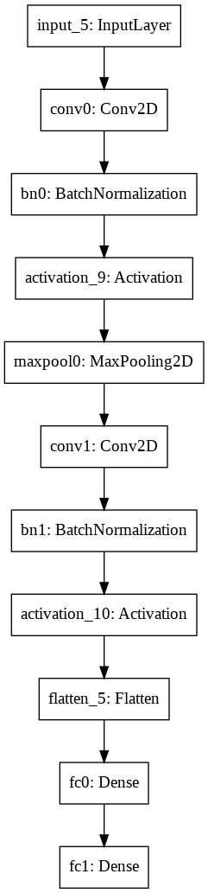

## Emotion Tracking

This project is a part of Convolutional Neural networks course from deeplearning.ai : 

https://www.coursera.org/learn/convolutional-neural-networks 

### Project Description:

A nearby community health clinic is helping the local residents monitor their mental health.  

As part of their study, they are asking volunteers to record their emotions throughout the day.

To help the participants more easily track their emotions, you are asked to create an app that will classify their emotions based on some pictures that the volunteers will take of their facial expressions.

As a proof-of-concept, you first train your model to detect if someone's emotion is classified as "happy" or "not happy."

To build and train this model, you have gathered pictures of some volunteers in a nearby neighborhood. The dataset is labeled.

----------------------------------------------------------------------
### Results :
| Loss | Test Accuracy |
|:---:|:---:|
| 0.076434  |  0.0.96000 |

Model :

